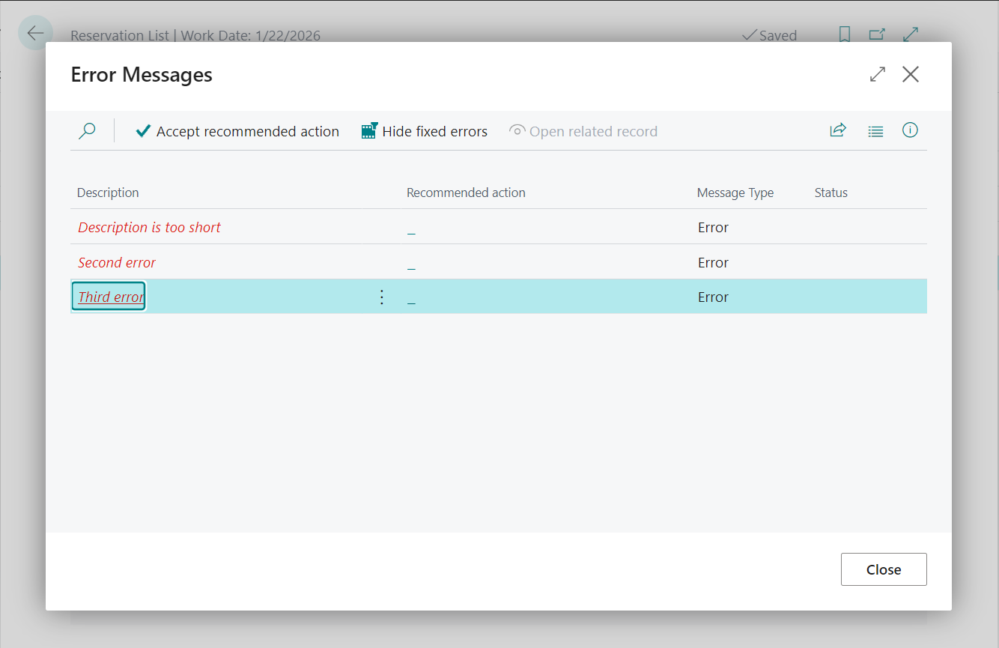

# Collectible Errors in Business Central

This guide outlines how to implement Collectible Errors in Business Central. Follow the steps below to achieve the desired functionality.

## Steps to Implement

### 1. Define a Codeunit for Field Validation
Create a Codeunit that handles the validation of your respective fields.

### 2. Create a Method/Procedure in the Corresponding Table
In the corresponding table, create a method or procedure that calls the Codeunit using `Codeunit.Run()`. This ensures that any changes made to the database within the Codeunit can be rolled back in case of errors.

### 3. Decorate the Method with `ErrorBehavior` Attribute
Decorate the corresponding method in the table with the `ErrorBehavior` attribute. 
> **Note:** It's not mandatory to decorate the respective method in the Codeunit with `ErrorBehavior`. Applying it in the table should be enough.

### 4. Handle Collected Errors
If there are collected errors, iterate through each one and add them to the "Error Message" record.

### 5. Call `ClearCollectedErrors()` Before Opening the Page
Before opening the respective page, ensure you call `ClearCollectedErrors()` to prevent the built-in error dialog from being displayed.

